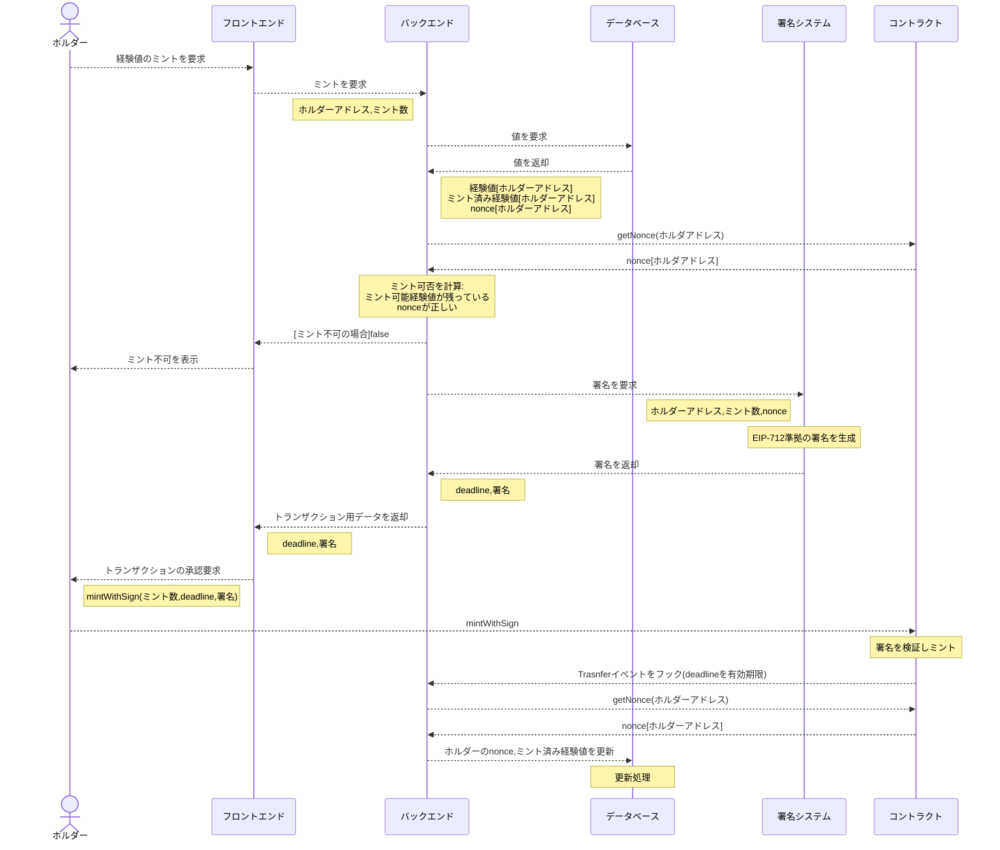

# battle-token
Battle Tokens are ERC20 tokens that are bridged from the Battle Heroes' exp.
To bridge from an off-chain database, they must be minted with a signature by the bridge system's private key.
This token will also be designed to be bridgeable beyond the minted chain by complying with LayerZero's OFT.

## 概要

　コントラクトの拡張性、整備性の観点から、Diamond Pattern([EIP-2535](https://github.com/mudgen/diamond))を採用した。これによりコントラクトの修正、拡張をモジュールごとに柔軟に実行することができる。またマルチチェーンNFTから派生したトークンであることから、LayerZeroのOmniFungibleTokenに準拠した。なお転送に当たってはガス代見積もりの取得が必要なため一般にdAppが必要になる。

## 経験値のトークンへの変換方法

### 処理のイメージ

上記は署名機能を現状のバックエンドと同一ドメイン内に追加した場合の一例。署名機能を例えばAWS KMSなどを使って別立てにする場合、ミント可否は署名者側からコントラクト・DBへの問い合わせを行うことが望ましい。

## Diamond standard

### Facets

- DiamondLoupeFacet.sol
    - Diamond pattern必須のFacet。Diamond関数の状態を確認する。
- OwnershipFacet.sol
    - Diamond pattern必須のFacet。Diamondのオーナーを規定する。
- PermissionControlFacet.sol
    - 権限管理用のFacet。
    - SoladyのOwnableRolesをベースに改修したPermissionControlを継承しFacet化。
- PHBTFacet.sol
    - ERC20/OFT準拠のトークン機能を規定するFacet。本コントラクトの本体。
    - ERC20はSoladyのERC20Permitを継承。
    - OFTはLayerZeroのsolidity-exampleをDiamond用に書き換えたものを継承。
    - 権限管理はPermissionControlの参照機能に限定した親コントラクトPermissionControlBaseを継承。
- Initializer
    - `DiamondInitV1.sol`を使用する。
    
これらの構成は現状は簡単なシナリオテストを記述した`PHBTInit.t.sol`を参照するとわかりやすい。