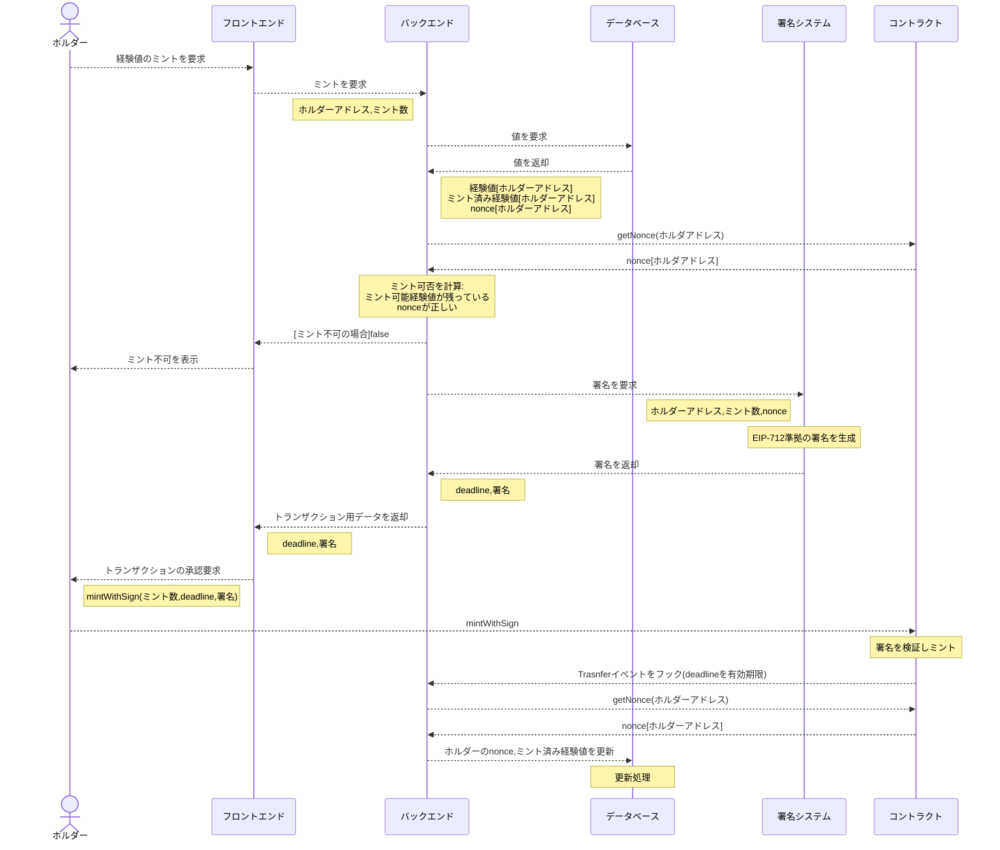

# battle-token
Battle Tokens are ERC20 tokens that are bridged from the Battle Heroes' exp.
To bridge from an off-chain database, they must be minted with a signature by the bridge system's private key.
This token will also be designed to be bridgeable beyond the minted chain by complying with LayerZero's OFT.

## 概要

　コントラクトの拡張性、整備性の観点から、Diamond Pattern([EIP-2535](https://github.com/mudgen/diamond))を採用した。これによりコントラクトの修正、拡張をモジュールごとに柔軟に実行することができる。またマルチチェーンNFTから派生したトークンであることから、LayerZeroのOmniFungibleTokenに準拠した。なおチェーン間転送に当たってはガス代見積もりの取得が必要なため一般にdAppが必要になる。

## 経験値のトークンへの変換方法

### 処理のイメージ

上記は署名機能を現状のバックエンドと同一ドメイン内に追加した場合の一例。署名機能を例えばAWS KMSなどを使って別立てにする場合、ミント可否は署名者側からコントラクト・DBへの問い合わせを行うことが望ましい。

## Diamond standard

### Facets

Diamondに追加するFacetsの概要を以下に記載する。

- DiamondLoupeFacet.sol
    - Diamond pattern必須のFacet。Diamond関数の状態を確認する。
- OwnershipFacet.sol
    - Diamond pattern必須のFacet。Diamondのオーナーを規定する。
- PermissionControlFacet.sol
    - 権限管理用のFacet。
    - SoladyのOwnableRolesをベースに改修したPermissionControlを継承しFacet化。
- PHBTFacet.sol
    - ERC20/OFT準拠のトークン機能を規定するFacet。本コントラクトの本体。
    - ERC20はSoladyのERC20Permitを継承。
    - OFTはLayerZeroのsolidity-exampleをDiamond用に書き換えたものを継承。
    - 権限管理はPermissionControlの参照機能に限定した親コントラクトPermissionControlBaseを継承。
    - 関数
        - `initialize(address _lzEndpoint, address _admin)`
            -  Facetを初期化する関数。LayerZeroEndpointと管理権限を与えるアドレスを渡す。
        - `mint(address to, uint256 amount)`
            - トークンをミントする。`MINTER_ROLE`を保有するアドレスのみ実行可能。 
        - `burn(address to, uint256 amount)`
            - トークンを償却する。`BURNER_ROLE`を保有するアドレスのみ実行可能。
        - `getNonce(address account)`
            - `account`アドレスのnonceを取得する。`mintWithSign()`を実行するたびに自動的に1ずつ増加する。
        - `getSigner()`
            - 署名ミントの署名者アドレスを返す。
        - `setSigner(address newSigner)`
            - 署名ミントの署名者アドレスを設定する。管理権限でのみ実行可能。
        - `mintWithSign(uint256 amount, uint256 nonce, uint256 deadline, bytes memory signature)`
            - 署名ミント用の署名に基づきミントを実行する。
        
- Initializer
    - `DiamondInitV1.sol`を使用する。

これらの構成は現状は簡単なシナリオテストを記述した`PHBTInit.t.sol`を参照するとわかりやすい。

### Utils

- FacetInitializable.sol
    - OpenZeppelinのv0.5相当の`Initializable.sol`からFacetごとに初期化をできるようにした初期化機能コントラクト。Initializableではreinitializerが定義されていない場合、一旦初期化すると機能追加時にInitializableコントラクトの初期化ができず流用できない。そのため新たにコントラクトをデプロイする必要がある。initializerにsaltを付与することで、Facetを追加する場合の初期化処理の柔軟性を高める。
    - 継承したコントラクトごとに重複しないsaltを設定する必要がある。

- PermissionControl
    - SoladyのOwnableRolesをベースに、Ownableの継承を廃止しOwner機能をAdminロールに振り替えた。OwnerがOwnershipFacetに定義されDiamondの構成に関与しており、これをinline assemblyで記述されるSolady/Ownableに置き換えるのは負担が大きいため。
    - OwnableRolesはもとよりnamed space storageに類似したストレージ管理をしているため、そのまま利用している。
    - Adminロールは`ADMIN_ROLE`で定義し、ご操作防止のため他のロールと同時に更新しようとするとrevertするようにした。
    - OwnableRolesは255ロールに限定するかわりに1つのアドレスに対して複数のロール制御を1スロットで効率的に管理する設計になっている。ロールは2^n(n=0..255)で表されており、ロール同士をOR演算することで同時に付与・返却・取消・権限確認を行うことができる。通常のAccessControlとはかなり異なるので使用時には要注意。
    - PermissionControlBase.sol
        - 権限制御機能として必須となるAdminロール、ロールのチェック、ロール制限modifierを定義。他のFacetで権限制御を行うためのコントラクト。
    - PermissionControl.sol
        - PermissionControlBase.solを継承し、権限管理を行うためのコントラクト。
    - ./constant/ConstantPermissionRole.sol
        - 権限ロール値を定義するコントラクト。必要に応じPermissionControlBaseとともに各Facetで継承して使用する。

- RestricByOwner.sol
    - OwnershipFacet.solのonlyOwner機能を他のFacetで使用するためのコントラクト。このコントラクトによりOwnershipFacet全体を継承せず最小限のコードでOwnershipによる制御を実装できる。

- BytesLibs.sol, ExcessivelySafeCall.sol
    - LayerZeroで使用するライブラリのコピー。
